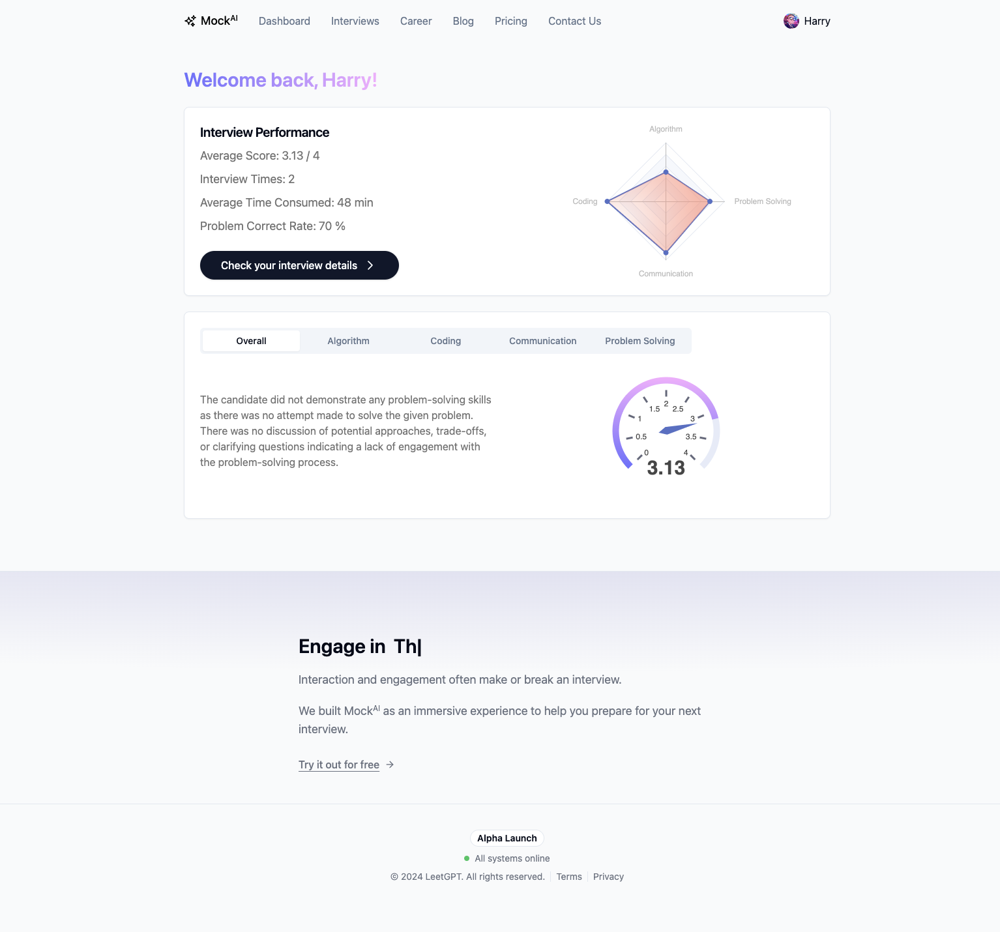

# Readme

## Before reading

1. To make the presentation effect more authentic, I developed `Header` and `Footer` that are almost identical to those of the Mock AI interface for use as the dashboard's `Header`and `Footer`. Additionally, I used `iframe` to simulate the effect of clicking other `Header` tabs in the header. This ensures that the Dashboard Page looks like integrated into the existing website visually.
2. All the evaluation metrics and data information in the demo project are mocked and stored in the `/mock` folder, and rendered on the front-end through API requests. These evaluation metrics are provisional and some data are created randomly, so we can do any modification.

## How to run

```bash
pnpm install

pnpm run dev
```

## Design choices

1. The development framework applies Next.js + shadcn/ui + tailwind.css based on the requirement.
2. The page's global style design is mainly based on the existing website design style.
3. APIs are implemented using API Routes + Server Functions.
4. The audio player component is based on the wavesurfer library.
5. The chart component is based on the echarts library.
6. The Code Editor component is based on the monaco-editor library.

## Dashboard features

### Main Page（Corresponding route: /dashboard）



1. The header, footer, animations, spacing, and other global features are remained consistent with the existing website.
2. Since a user may have several interview records, the main page primarily displays the overall information about the user's interviews. This includes, but is not limited to: the average score given by the system, number of interviews, average time spent per interview, accuracy rate of solving problems, as well as average scores and overall feedback and suggestions from AI across four dimensions—Algorithm, Coding, Communication, Problem Solving (these overall evaluation metrics are provisional and can be expanded upon).
3. There is a button labeled "Check your interview details". When clicked, it takes the user to the details page for each interview.

### Interview Detail Page（Corresponding route: /dashboard/detail/[id]）


Firstly, some global features still be consistent with the existing website. At the same time, the interface supports sliding vertical gap line to control the size of the left and right panels. The Problem Tab area also supports sliding horizontal gap line to control the size of the Code and Question sections.

In the top right corner of the page, there is a Selection dropdown menu for users to choose the interview they want to view (since a user will have many interview records, a dropdown menu is necessary to switch between them), with the default value being the latest interview record.

Then, the details page is divided into several modules:

**Recording + AI Analysis Module**

1. Visualized audio waveforms, supporting play/pause, fast forward/rewind, speed adjustment, and download. It also allows dragging, zooming in/out, and playing from any position on the track.
2. The green sections represent AI Suggestions produced by our system (mock data for several time periods here). When the track reaches a green block, the AI Suggestion field below will display the suggestion. If the user checks the Loop AI Suggestion radio button, it will repeatedly play the current green block's section.
3. A placeholder for the audio-to-text transcription feature is designed. The implementation of audio transcription into text involves sending the audio from the server to a voice recognition service like Google Cloud Speech-to-Text, transcribing it into text, and then sending it back to the frontend.

**Problem Display Module**

If the tab at the top right half switches to "Problem", it enters the problem display module. 

Assume that, if a user listens to the audio without being able to see the corresponding interview questions and their answers on the current page, it will be very unintuitive and inconvenient. 

Therefore, a problem display module is designed here. Since it is uncertain what library the original site's UI is based on, Monaco-editor is temporarily used as a substitute.

**Metrics Display Module**

If the tab at the top right half switches to "Score," it enters the metrics display module. 

This module will display the scores for this interview across four dimensions: Algorithm, Coding, Communication, and Problem Solving, as well as feedback and suggestions provided by the AI.

### One more thing: **Targeted Train**


This is an design out of requirement. The data is all mocked.

**The main purpose of this feature:**

Based on AI Suggestion and the system's scoring of user interviews, a series of questions, courses or articles are recommended for users to further improve their abilities. At the same time, this is also a possible idea for our business expansion in the future. We can provide pay option, or cooperate with third-party related platforms, etc.

**Trigger time:**

1. When the audio generates AI Suggestion, a button will be displayed
2. In Score Tab, a button will be displayed

## Q&A

Here is mainly used to answer some questions from the Assignment document.

### Q: While actual recordings will not be provided due to security constraints, you should outline how the application would retrieve and process this data.

Although no audio data was provided, I used two WAV-format songs to simulate interview recordings. Additionally, I implemented API routes to fetch and download the audio. The code is located in `/src/pages/api`.

The main logic for retrieving and processing the audio data is as follows: handling requests and parameters → reading audio files from the database (simulated here as reading from a project folder) → processing the audio files (including error handling) → returning data.

A special note here is that the assignment mentioned that the recordings can be up to an hour long. This might lead to significant loading times due to the large size of the audio files, preventing users from freely adjusting the playback position at the start (as the files may be too large to load). Therefore, it is necessary to implement range requests, which load the file from a specified range to ensure that the audio can be played immediately from any position.

A simple code example is as follows:

```tsx
if (range) {
  const parts = range.replace(/bytes=/, "").split("-");
  const start = parseInt(parts[0], 10);
  const end = parts[1] ? parseInt(parts[1], 10) : fileSize - 1;
  const chunksize = end - start + 1;
  const file = fs.createReadStream(filePath, { start, end });
  const head = {
    "Content-Range": `bytes ${start}-${end}/${fileSize}`,
    "Accept-Ranges": "bytes",
    "Content-Length": chunksize,
    "Content-Type": "audio/wav",
  };
  res.writeHead(206, head);
  file.pipe(res);
  res.status(200);
} else {
  const head = {
    "Content-Length": fileSize,
    "Content-Type": "audio/wav",
  };
  res.writeHead(200, head);
  fs.createReadStream(filePath).pipe(res);
}
```

For more implementation details, please refer to the `/src/pages/api/get-audio/index.ts` code.

### Q: Security Consideration: While you won't be working with actual audio files, include a brief description of how data security and privacy would be handled when fetching and displaying data.

To answer this question, we need to consider several perspectives.

**Firstly, from a technical view:**

1. Ensure that all transmitted audio data is encrypted using HTTPS, which prevents data interception during transmission.
2. Use POST requests to query data from the node backend.
3. Ensure that requests to the database API are made by the Next.js node server, not directly from the frontend. This helps to hide the actual request URL.
4. Encrypt audio data stored on the server to ensure that even if data is accessed illegally, it cannot be easily deciphered.

**Secondly, from an application view:**

1. Ensure that all requests accessing audio data are authenticated (i.e., login required). The original site has already implemented user login and authorization features.
2. For audio permissions management, we can ensure that access to audio is finely controlled based on user levels. For example, only the uploader or authorized users can access audio data.
3. Implement logging and monitoring to record and supervise access to audio data, allowing for traceability and response in case of security incidents.

**Finally:**

We should also inform users of our privacy policy. Clearly explain to users how the application collects, uses, and stores audio data.

## The end

If you have any questions or suggestions, don’t hesitate to let me know! I will appreciate your feedback, it will be helpful.

Thank you very much!

Haowei Xiong

harryxiong24@gmail.com | haoweix3@uci.edu